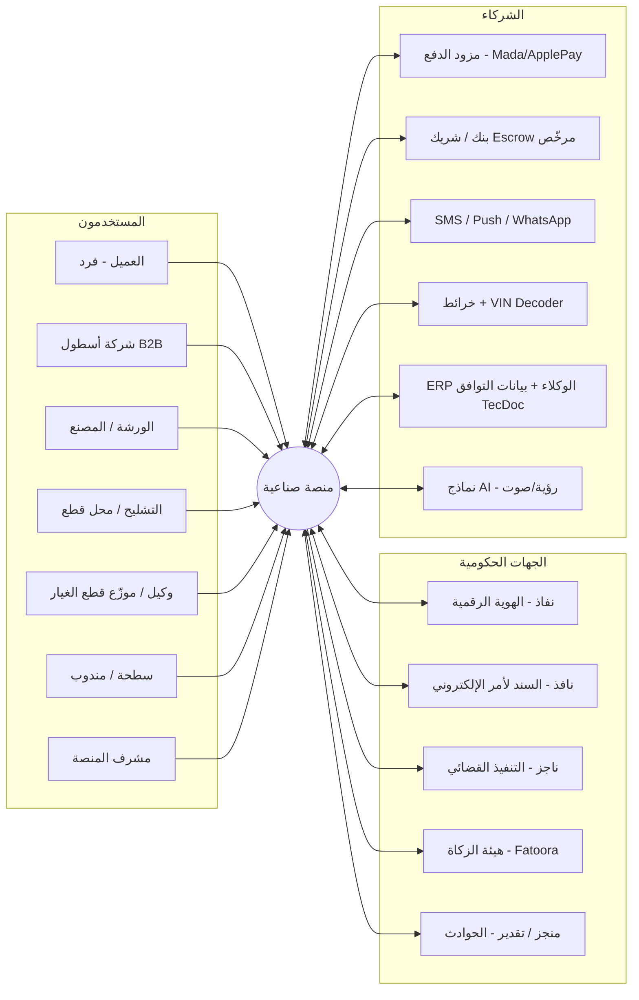
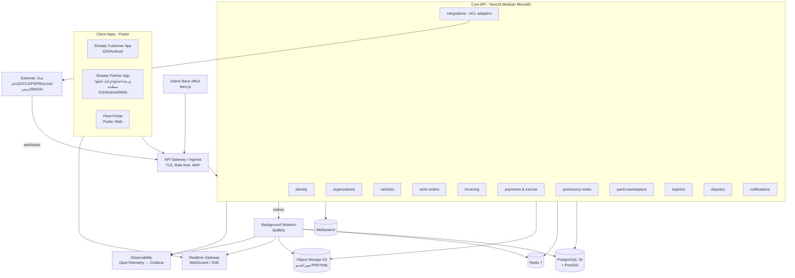
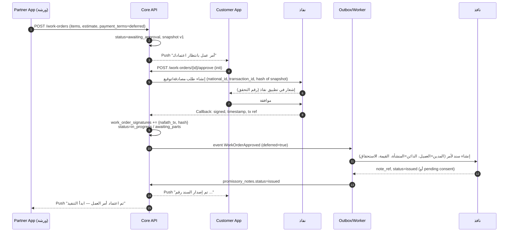

# صناعية — مواصفات بنية النظام (Systems Architecture Spec)

> الإصدار 1.0 — 2026-08-17. يُقرأ مع [01-PRD.md](./01-PRD.md) و [03-TECH-STACK.md](./03-TECH-STACK.md) و [04-DATABASE.md](./04-DATABASE.md).

---

## 1. المبادئ المعمارية (Architectural Principles)

1. **Modular Monolith أولاً، Microservices عند الحاجة:** خدمة Backend واحدة (NestJS) مقسّمة إلى Modules ذات حدود واضحة (Bounded Contexts). كل Module له DB schema منطقي خاص، ولا يستدعي جداول Module آخر مباشرة بل عبر واجهته. هذا يسمح بفصل أي Module إلى خدمة مستقلة لاحقاً (مثل `bidding` أو `integrations`).
2. **كل عملية قانونية/مالية = حدث موثّق:** لا يوجد تغيير في حالة أمر عمل أو فاتورة أو سند دون Event مسجّل في `audit_log` (Append-only) و Domain Event على الـ Outbox.
3. **التكاملات الخارجية معزولة (Anti-Corruption Layer):** كل جهة (نفاذ/نافذ/ZATCA/الدفع/منجز) لها Adapter مستقل بواجهة (Port) داخلية، مع Mock Adapter للتطوير والاختبار، لأن معظم هذه الجهات لا توفر Sandbox مفتوحاً.
4. **Idempotency في كل مكان:** كل استدعاء لتكامل خارجي وكل Webhook وارد يحمل مفتاح Idempotency ويُخزَّن في `integration_requests`.
5. **Ledger مزدوج القيد كمصدر الحقيقة المالي:** أرصدة المحافظ مشتقة من الـ ledger، لا العكس.
6. **إقامة البيانات داخل المملكة (Data Residency)** ومبدأ الحد الأدنى من PII.
7. **عربي أولاً / RTL أولاً** في كل واجهة، والإنجليزية ثانوية.

---

## 2. النظرة العليا (C4 — Level 1: System Context)



---

## 3. الحاويات (C4 — Level 2: Containers)



### 3.1 التطبيقات
| الحاوية | التقنية | الجمهور | ملاحظات |
|---|---|---|---|
| **Customer App** | Flutter (flavor `customer`) | الأفراد | نفاذ Login، Work Orders، الدفع، Car Passport، طلب قطع/سطحة |
| **Partner App** | Flutter (flavor `partner`) | الورش/التشاليح/وكلاء القطع/السطحات | نفس Codebase مع أدوار؛ Offline-first لتحديث الحالة والصور؛ Voice-to-Invoice |
| **Fleet Portal** | Flutter Web (flavor `fleet`) | شركات الأساطيل | لوحات تحكم، اعتمادات، تقارير |
| **Admin Back-office** | Next.js + shadcn/ui | فريق المنصة | KYB، النزاعات، مراقبة التكاملات، التسويات |

> قرار: الحفاظ على Flutter كـ Codebase واحد لكل الأطراف (Multi-flavor + Role-based navigation) لتقليل التكلفة. لوحة الإدارة الداخلية فقط بـ Next.js لأنها كثيفة الجداول والتقارير.

### 3.2 Core API — الـ Modules والحدود
| Module | المسؤولية | يمتلك الجداول |
|---|---|---|
| `identity` | نفاذ OIDC، OTP، JWT، الأجهزة، RBAC | users, sessions, devices, roles |
| `organizations` | المنشآت (ورشة/تشليح/أسطول/لوجستيات)، الأعضاء، KYB، الاشتراكات | organizations, org_members, subscriptions |
| `vehicles` | المركبات، VIN decode، Car Passport | vehicles, vehicle_events |
| `work-orders` | أوامر العمل، البنود، الفحوصات، المراحل، التوقيعات | work_orders, work_order_items, inspections, media |
| `invoicing` | الفواتير، ZATCA، الإشعارات الدائنة | invoices, invoice_lines, zatca_submissions |
| `payments` | المدفوعات، Escrow، المحافظ، Ledger، Payouts | payments, escrow_holds, ledger_*, payouts |
| `promissory-notes` | دورة حياة السند (نافذ) والمخالصات والتنفيذ | promissory_notes, pn_events, settlements |
| `parts-marketplace` | الكتالوج الموحّد وتوافق VIN، مخزون الموردين الحي (ERP sync)، طلبات القطع والمزاد العكسي، Buy Now، الحساب الآجل المضمون (وكيل↔ورشة)، مصادقة القطع بالـ QR، الضمانات | parts_catalog, part_fitments, supplier_inventory, trade_accounts, part_serials, part_requests, part_bids, part_orders, warranties |
| `logistics` | السطحات، التوصيل، التتبع | transport_jobs, transport_tracking |
| `disputes` | النزاعات، الأدلة، القرارات | disputes, dispute_evidence |
| `notifications` | Push/SMS/Email/WhatsApp، القوالب | notifications, templates |
| `integrations` | Adapters + Outbox + Webhooks + Idempotency | integration_requests, webhook_events, outbox |
| `audit` | سجل التدقيق غير القابل للتعديل | audit_log |

---

## 4. تدفقات النظام الحرجة (Sequence Diagrams)

### 4.1 اعتماد أمر العمل عبر نفاذ + إصدار السند في نافذ


### 4.2 السداد ➔ إغلاق السند ➔ المخالصة ➔ الإفراج من Escrow
```mermaid
sequenceDiagram
  autonumber
  participant C as Customer App
  participant API as Core API
  participant PSP as مزود الدفع
  participant L as Ledger
  participant OB as Worker
  participant NZ as نافذ
  participant W as Partner App

  C->>API: POST /invoices/{id}/pay (method=mada|apple_pay)
  API->>PSP: create payment intent (idempotency_key)
  PSP-->>C: صفحة/Sheet الدفع
  C->>PSP: يدفع
  PSP-->>API: Webhook payment.succeeded (signature verified)
  API->>L: entry: DR psp_receivable / CR escrow_liability(org)
  API->>API: invoice.status=paid ; escrow_hold=held
  API->>OB: event InvoicePaid
  OB->>NZ: إغلاق/إلغاء السند note_ref
  NZ-->>OB: closed
  OB->>API: promissory_note.status=closed + توليد مخالصة PDF
  API-->>C: Push + PDF المخالصة
  Note over API,W: عند delivered + توقيع الاستلام أو مرور 72 ساعة بلا نزاع
  API->>L: entry: DR escrow_liability(org) / CR org_available ; DR org_available / CR platform_fees
  OB->>PSP: payout إلى IBAN المنشأة
  API-->>W: Push "تم تحويل المستحقات"
```

### 4.2b الورشة تشتري من وكيل القطع بالآجل المضمون (Trade Account)
```mermaid
sequenceDiagram
  autonumber
  participant W as Partner App (ورشة)
  participant API as Core API
  participant NF as نفاذ
  participant OB as Worker
  participant NZ as نافذ
  participant D as Partner App (وكيل قطع)

  Note over W,D: مرة واحدة: فتح حساب آجل
  W->>API: POST /trade-accounts (seller=وكيل, requested_limit)
  D->>API: approve (credit_limit=20000, terms=30d)
  API->>NF: توقيع مالك الورشة على اتفاقية الحساب
  NF-->>API: signed → trade_accounts.status=active

  Note over W,D: كل عملية شراء
  W->>API: GET /parts/fit?vin=... → catalog+inventory (وكيل: متوفر، trade_price)
  W->>API: POST /part-orders {source:catalog_buy_now, items[], payment_terms:deferred, trade_account_id}
  API->>API: تحقق الحد الائتماني (outstanding+total ≤ credit_limit) ; حجز الكمية
  API->>OB: event PartOrderPlaced(deferred)
  OB->>NZ: إنشاء سند لأمر (creditor=وكيل, debtor=ورشة, due=+30d)
  NZ-->>OB: issued → promissory_notes
  API-->>D: Push "طلب جديد — جهّز للتوصيل"
  D->>API: transition shipped (transport_job) → delivered
  W->>API: POST /part-serials/{qr}/install {work_order_item_id}
  API->>API: part_serials.status=installed ; vehicle_events ; warranties(part_and_labor)
  Note over W,NZ: بعد 30 يوماً أو قبلها
  W->>API: POST /trade-accounts/{id}/pay (من المحفظة/Mada)
  API->>OB: InvoicePaid → إغلاق السند + مخالصة → outstanding يتناقص
```

### 4.3 المزاد العكسي للقطع
```mermaid
sequenceDiagram
  autonumber
  participant R as طالب القطعة (عميل/ورشة)
  participant API as Core API
  participant M as Matching Worker
  participant S1 as مورد 1..N
  participant RT as Realtime

  R->>API: POST /part-requests (vin, part, photos, radius)
  API->>M: event PartRequestCreated
  M->>M: match: PostGIS radius + brand + category + org rating
  M-->>S1: Push "طلب قطعة جديد قريب منك"
  S1->>API: POST /part-requests/{id}/bids (price, condition, warranty_days, media)
  API-->>RT: bid.created → R يشاهد العروض لحظياً
  Note over API: انتهاء النافذة (60 دقيقة) أو قبول مبكر
  R->>API: POST /bids/{id}/accept
  API->>API: part_order created ; escrow payment intent
```

---

## 5. آلة الحالات (State Machines)

### 5.1 Work Order
```
draft ─► received ─► inspecting ─► awaiting_approval ─► (approved)
   ─► awaiting_parts ⇄ in_progress ─► quality_check ─► ready ─► delivered ─► closed
                                                     └─► abandoned_flow (بعد N يوم في ready)
أي حالة قبل delivered ─► cancelled (بشروط) | disputed (يجمّد الإفراج)
```
- الانتقالات مسموحة فقط عبر `WorkOrderService.transition(id, to, actor, reason)` وتُسجَّل في `work_order_status_history`.
- أي تغيير في البنود بعد الاعتماد = `change_order` جديد بحالة `awaiting_approval` مع نسخة Snapshot جديدة.

### 5.2 Promissory Note (نافذ)
```
draft ─► pending_consent ─► issued ─► (partially_settled) ─► closed
                          └► rejected                       └► in_enforcement ─► enforced/closed
issued ─► cancelled (إلغاء أمر العمل قبل التنفيذ)
```

### 5.3 Escrow Hold
```
pending ─► held ─► released | refunded | frozen(dispute) ─► released/refunded/split
```

### 5.4 Part Request / Bid
```
request: open ─► bidding ─► awarded ─► fulfilled | expired | cancelled
bid:     submitted ─► accepted | rejected | withdrawn | expired
```

---

## 6. التكاملات (Integration Layer)

| التكامل | النمط | Adapter | ملاحظات تنفيذية |
|---|---|---|---|
| **نفاذ (Nafath)** | OIDC / REST + Callback | `NafathAdapter` | Login (SSO) وأيضاً "طلب مصادقة على معاملة" لتوقيع أمر العمل؛ نخزّن `transaction_id`, `random`, hash المستند الموقّع. Mock في dev. |
| **نافذ (Nafez)** | REST (حسب اتفاقية وزارة العدل) | `NafezAdapter` | إنشاء سند، استعلام حالة، إغلاق/إلغاء، تعديل قيمة. كل استدعاء عبر Outbox مع Retry (exponential) + DLQ. |
| **ناجز (Najiz)** | غالباً يدوي/بوابة | `NajizAdapter` (تحضير ملف) | المنصة تُجهّز حزمة التنفيذ (السند + الفاتورة + الأدلة) وتوجّه المستخدم؛ تتبع الحالة يدوياً في المرحلة الأولى. |
| **ZATCA Fatoora** | REST (Compliance/Production CSID, Clearance, Reporting) | `ZatcaAdapter` | توليد UBL 2.1 XML، توقيع XAdES، QR TLV، PIH chain لكل منشأة/جهاز. Sandbox متاح رسمياً. |
| **مزود الدفع** | REST + Webhooks | `PaymentGatewayAdapter` | Mada/Apple Pay/Visa/MC؛ Tokenization؛ Idempotency؛ التحقق من توقيع Webhook. |
| **Escrow** | REST / Split-payout | `EscrowAdapter` | عبر شريك مرخّص؛ إن لم يتوفر API فيُدار الحساب الضامن كحساب مجمّع لدى الشريك مع Ledger داخلي دقيق. |
| **منجز/تقدير** | REST/ملفات | `AccidentReportAdapter` | تسجيل التقرير + استرجاع حالة الحادث. يُبنى Interface أولاً وMock حتى تأكيد API. |
| **VIN Decoder** | REST | `VinDecoderAdapter` | مزود تجاري + جدول محلي للأكثر شيوعاً. |
| **ERP الوكيل (مخزون)** | CSV مجدول / REST / SFTP | `InventorySyncPort` → `CsvInventoryAdapter`, `GenericRestInventoryAdapter`, لاحقاً `SapB1Adapter`/`OdooAdapter` | مزامنة كميات وأسعار `supplier_inventory` بـ `external_sku`؛ كل تشغيل يُسجَّل في `inventory_sync_runs`. |
| **بيانات التوافق (Fitment)** | ملفات/REST | `FitmentDataPort` (TecDoc أو ملفات الوكيل) | تغذية `part_fitments`؛ Mock بمجموعة موديلات شائعة في السعودية. |
| **Maps** | REST | `GeoAdapter` | Geocoding، مسافات للسطحات. |
| **AI** | REST | `VisionAdapter`, `SpeechAdapter` | كشف الأضرار من الصور، تحويل الصوت العربي إلى بنود. |
| **Messaging** | REST | `SmsAdapter`, `PushAdapter (FCM/APNs)`, `WhatsAppAdapter` | قوالب عربية معتمدة. |

**Outbox Pattern:** كل Domain Event يُكتب في `outbox` داخل نفس Transaction، ثم Worker ينشره إلى BullMQ. يضمن عدم فقدان أحداث مالية/قانونية.

**Webhook Inbox:** كل Webhook وارد يُخزَّن أولاً في `webhook_events` (raw + signature check) ثم يُعالج بشكل غير متزامن مع Idempotency على `provider_event_id`.

---

## 7. الأمان والامتثال

- **Auth:** نفاذ (OIDC) للأفراد؛ OTP للأدوار التشغيلية؛ Access JWT (15 دقيقة) + Refresh Token دوّار مربوط بالجهاز؛ Device binding + Biometric محلي.
- **RBAC + ABAC:** أدوار (`customer`, `org_owner`, `org_manager`, `technician`, `accountant`, `driver`, `fleet_admin`, `platform_admin`) + قواعد ملكية المورد (العميل يرى أوامره فقط…). تُطبّق في Guards + Row-level checks في الـ Repositories.
- **PII:** تشفير الهوية الوطنية/IBAN بـ AES-256-GCM (مفاتيح في KMS/Vault)، Hash للبحث، إخفاء في السجلات، وحق المسح مع الاحتفاظ بالسجلات القانونية.
- **التوقيعات:** كل مستند موقّع نخزّن `sha256` للمحتوى (Snapshot JSON + PDF) + مرجع نفاذ + الوقت + IP/جهاز.
- **Audit Log:** جدول Append-only مع `prev_hash` لسلسلة Hash؛ لا صلاحية UPDATE/DELETE لدور التطبيق.
- **Rate limiting** بالـ Redis، WAF على Ingress، CSP للويب، Pinning اختياري في التطبيق.
- **Compliance:** PDPL (إقامة البيانات + سياسات الاحتفاظ)، ZATCA (أرشفة 6 سنوات)، ساما (لا حجز أموال إلا عبر شريك مرخّص)، سجلات نفاذ.

---

## 8. البنية التحتية والنشر

```
Region: داخل المملكة (مثل: AWS me-central-1 / Oracle Jeddah / STC Cloud / SCCC-Alibaba) — يُحسم في P1
├── Kubernetes (managed) أو ECS
│   ├── api (NestJS)         × 3+ replicas, HPA
│   ├── workers (BullMQ)     × 2+ (queues: integrations, notifications, media, matching, settlements)
│   ├── realtime (ws)        × 2
│   └── admin-web (Next.js)
├── PostgreSQL 16 managed (Multi-AZ) + PostGIS + PgBouncer ; PITR backups
├── Redis 7 (managed) — cache, queues, rate-limit, presence
├── Object Storage (S3-compatible) — buckets: media/, documents/ (WORM للفواتير والمخالصات)
├── Meilisearch — بحث المنشآت/القطع
├── Secrets: Vault / cloud KMS
└── Observability: OpenTelemetry → Grafana/Tempo/Loki/Prometheus ; Sentry للتطبيقات
Environments: local (docker-compose) → dev → staging (تكاملات Sandbox) → prod
CI/CD: GitHub Actions — lint/test/build → docker → deploy (ArgoCD/Helm أو GitOps)
```

---

## 9. قرارات معمارية مسجّلة (ADR Summary)

| ADR | القرار | البدائل المرفوضة | السبب |
|---|---|---|---|
| ADR-001 | NestJS (TypeScript) Modular Monolith | Go microservices من البداية | سرعة التطوير، توفر المطورين محلياً، نضج المكتبات؛ يمكن نقل الأجزاء الحرجة إلى Go لاحقاً |
| ADR-002 | Flutter لجميع تطبيقات الأطراف (multi-flavor) | تطبيقات منفصلة | مشروع Flutter موجود بالفعل، تقليل التكلفة |
| ADR-003 | Prisma كـ ORM + Raw SQL للـ Ledger والاستعلامات المعقدة | TypeORM / Drizzle | Type-safety، Migrations واضحة |
| ADR-004 | Ledger مزدوج القيد داخلي | الاعتماد على تقارير مزود الدفع | مصدر حقيقة مالي مستقل وقابل للتدقيق |
| ADR-005 | Outbox + BullMQ للتكاملات | استدعاء مباشر متزامن | موثوقية أمام تقطع الجهات الحكومية |
| ADR-006 | Next.js فقط للـ Back-office | Flutter Web للإدارة | تجربة جداول/تقارير أفضل للفريق الداخلي |
| ADR-007 | **Clean Architecture** داخل كل Module/Feature: `domain → application → infrastructure/interface` (API) و`domain → data → presentation` (Flutter)، مع قاعدة الاعتماد نحو الداخل مفروضة بالـ Lint | طبقات Controller/Service/Repository التقليدية | قابلية اختبار المنطق المالي/القانوني بلا DB أو شبكة، وسهولة استبدال مزودي التكامل |

---

## 10. مخطط الـ API (نظرة عامة — REST v1)

```
POST   /v1/auth/nafath/initiate            POST /v1/auth/nafath/callback
POST   /v1/auth/otp/request                POST /v1/auth/otp/verify
GET    /v1/me                              PATCH /v1/me

GET/POST /v1/organizations                 GET/PATCH /v1/organizations/{id}
POST   /v1/organizations/{id}/members      POST /v1/organizations/{id}/kyb-documents

GET/POST /v1/vehicles                      GET /v1/vehicles/{id}/passport
GET    /v1/vin/{vin}/decode

GET/POST /v1/work-orders                   GET/PATCH /v1/work-orders/{id}
POST   /v1/work-orders/{id}/items          POST /v1/work-orders/{id}/inspections
POST   /v1/work-orders/{id}/approve        POST /v1/work-orders/{id}/transition
POST   /v1/work-orders/{id}/change-orders  GET  /v1/work-orders/{id}/timeline

POST   /v1/invoices                        GET  /v1/invoices/{id}  GET /v1/invoices/{id}/pdf
POST   /v1/invoices/{id}/pay               POST /v1/invoices/{id}/credit-notes

GET    /v1/promissory-notes                GET  /v1/promissory-notes/{id}
POST   /v1/promissory-notes/{id}/enforce   GET  /v1/promissory-notes/{id}/settlement.pdf

GET    /v1/parts/fit?vin=…&q=…             GET  /v1/parts/catalog/{id}   GET /v1/parts/catalog/{id}/offers
POST   /v1/suppliers/{orgId}/inventory/import  (CSV)   GET /v1/suppliers/{orgId}/inventory
GET/POST /v1/trade-accounts                POST /v1/trade-accounts/{id}/approve  POST /v1/trade-accounts/{id}/pay
GET    /v1/part-serials/{qr}/verify        POST /v1/part-serials/{qr}/install
GET/POST /v1/group-buys                    POST /v1/group-buys/{id}/join
GET/POST /v1/part-requests                 POST /v1/part-requests/{id}/bids
POST   /v1/bids/{id}/accept                GET/POST /v1/part-orders
GET    /v1/warranties/{id}                 POST /v1/warranties/{id}/claims

GET/POST /v1/transport-jobs                POST /v1/transport-jobs/{id}/location

GET/POST /v1/disputes                      POST /v1/disputes/{id}/evidence
GET    /v1/wallet                          GET  /v1/wallet/ledger  GET /v1/payouts

POST   /v1/webhooks/psp                    POST /v1/webhooks/nafez   POST /v1/webhooks/zatca
WS     /realtime  (channels: work-order:{id}, part-request:{id}, transport:{id})
```
