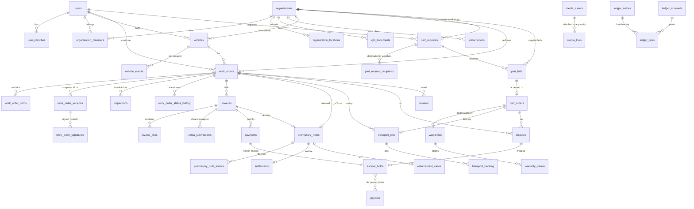

# صناعتي — تصميم قاعدة البيانات (PostgreSQL 16)

> DDL الكامل والقابل للتنفيذ في [db/schema.sql](./db/schema.sql) (79 جدولاً، تم التحقق منه على PostgreSQL 16).
> هذا الملف يشرح النموذج والعلاقات والقرارات.

## 1. الاصطلاحات
| القاعدة | التفصيل |
|---|---|
| المفاتيح | `uuid` (التطبيق يولّد UUIDv7 لترتيب زمني؛ الافتراضي في DB `gen_random_uuid()`) |
| الأرقام البشرية | `WO-2026-000123`, `PN-…`, `PR-…`, `PO-…`, `TJ-…`, `DS-…`, `WR-…`, `MK-…` عبر الدالة `next_number(prefix)`؛ الفواتير تسلسلية **لكل منشأة** (`invoice_sequences`) لمتطلبات ZATCA |
| المال | `NUMERIC(14,2)` بالريال، العمولات بـ basis points (`commission_rate_bps`) |
| الوقت | `timestamptz` (UTC) |
| اللغة | `*_ar` إلزامي، `*_en` اختياري |
| PII | `national_id_enc`, `iban_enc` مشفّرة (AES-GCM) + `*_hash` للبحث |
| Append-only | `audit_log`, `ledger_entries`, `work_order_versions`, `work_order_signatures`, `settlements`, `promissory_note_events` محمية بـ Trigger يمنع UPDATE/DELETE |
| Soft delete | `deleted_at` فقط على `users`, `organizations`, `vehicles` |
| Geo | `geography(Point,4326)` + GiST للمطابقة (ورش، موردون، سطحات) |

## 2. خريطة الجداول حسب الـ Module

| Module | الجداول |
|---|---|
| identity | `users`, `user_identities`, `devices`, `refresh_tokens`, `otp_challenges` |
| organizations | `organizations`, `organization_locations`, `organization_members`, `organization_specialties`, `organization_bank_accounts`, `kyb_documents`, `subscription_plans`, `subscriptions`, `vehicle_makes`, `vehicle_models`, `service_categories` |
| media | `media_assets`, `media_links` |
| vehicles | `vehicles`, `vehicle_events` (Car Passport) |
| work-orders | `work_orders`, `work_order_items`, `work_order_versions`, `work_order_signatures`, `work_order_status_history`, `inspections`, `voice_notes` |
| invoicing | `invoice_sequences`, `invoices`, `invoice_lines`, `zatca_devices`, `zatca_submissions` |
| payments | `payments`, `escrow_holds`, `ledger_accounts`, `ledger_entries`, `ledger_lines`, `ledger_balances` (view), `payouts`, `payout_items`, `refunds` |
| promissory-notes | `promissory_notes`, `promissory_note_events`, `settlements`, `enforcement_cases`, `dunning_notices` |
| parts-marketplace | `part_categories`, `part_brands`, `parts_catalog`, `part_fitments`, `part_serials`, `trade_accounts`, `supplier_inventory`, `inventory_sync_runs`, `part_requests`, `part_request_recipients`, `part_bids`, `part_orders`, `part_order_items`, `group_buys`, `warranties`, `warranty_claims` |
| logistics | `transport_jobs`, `transport_tracking`, `driver_profiles` |
| disputes | `disputes`, `dispute_messages`, `reviews` |
| fleet | `fleet_policies`, `fleet_approvals`, `fleet_statements` |
| notifications | `notification_templates`, `notifications` |
| integrations | `outbox`, `integration_requests`, `webhook_events`, `integration_credentials` |
| audit / config | `audit_log`, `platform_settings`, `sequences_counters` |

## 3. مخطط العلاقات (ERD — الكيانات الجوهرية)



## 4. القرارات التصميمية المهمة

### 4.1 أمر العمل ثلاثي الطبقات (Items / Versions / Signatures)
- `work_order_items` هي الحالة الحية القابلة للتعديل (مع `version_added/version_removed` لتتبع كل بند عبر الإصدارات).
- عند طلب اعتماد يُجمَّد **Snapshot** كامل في `work_order_versions.snapshot` (JSONB) مع `snapshot_sha256` — هذا هو ما يوقّعه العميل عبر نفاذ.
- `work_order_signatures` يربط التوقيع بالإصدار المحدد + مرجع نفاذ + الـ hash. أي نزاع لاحق يُحسم بمقارنة الـ hash.
- الجداول الثلاثة الأخيرة Append-only.

### 4.2 المالية: Ledger هو مصدر الحقيقة
- كل حركة (Capture، Escrow release، عمولة، Payout، Refund) = `ledger_entries` واحد + سطور متوازنة في `ledger_lines`؛ Trigger مؤجّل يرفض أي قيد غير متوازن عند COMMIT.
- الحسابات النموذجية: `psp_clearing` (Asset)، `escrow_liability:{org}` (Liability)، `org_available:{org}` (Liability)، `platform_revenue:commission` / `:note_fee` / `:logistics` (Revenue)، `vat_payable` (Liability).
- `escrow_holds` طبقة تشغيلية فوق الـ Ledger تحدد "لمن ومتى يُفرَج"، و`payouts` تجمع الإفراجات في تحويل بنكي واحد.
- **قيد Escrow نموذجي عند السداد:** `DR psp_clearing 1,150 / CR escrow_liability:org 1,150`؛ عند الإفراج: `DR escrow_liability:org 1,150 / CR org_available:org 1,092.50 / CR platform_revenue:commission 57.50`.

### 4.3 السند لأمر (نافذ) والمخالصة
- `promissory_notes` يرتبط اختيارياً بـ `work_order_id` و/أو `invoice_id` و/أو `part_order_id` (السند قد يُنشأ عند الاعتماد قبل الفاتورة).
- `outstanding_amount` يتناقص مع كل `promissory_note_events(amount_delta, payment_id)`؛ عند الوصول لصفر تُغلق الحالة ويُنشأ `settlements` بـ PDF + hash.
- `enforcement_cases` يدعم علم `is_abandoned_vehicle` ورسوم الإيواء لمسار السيارات المهجورة.
- `dunning_notices` يوثّق التذكيرات الرسمية قبل التنفيذ (مطلوب كدليل).

### 4.4 سوق القطع
- `part_request_recipients` يسجّل **من وصله الطلب** (لقياس معدل الاستجابة ولإثبات التوزيع العادل).
- `part_bids` بقيد فريد `(request_id, supplier_org_id)` — المورد يحدّث عرضه بدل تكرار الصفوف.
- `part_orders` هو العقد بعد القبول ويرتبط بالـ Escrow والفاتورة والنقل والضمان.
- `warranties` مستقلة عن مصدرها (قطعة من السوق أو بند في أمر عمل) ولها `qr_token` عام للتحقق.

### 4.4b بوابة وكلاء القطع (Catalog / Fitment / Trade / Serials)
- **الكتالوج مفصول عن المخزون:** `parts_catalog` يعرّف القطعة مرة واحدة (علامة + رقم مصنّع + أرقام OEM مكافئة)، و`supplier_inventory` يربط كل مورد بالقطعة بكمية وسعرين (`price` تجزئة / `trade_price` للورش) وموقع فرع. مخزون التشليح غير المفهرس يبقى بـ `catalog_id NULL`.
- **توافق VIN:** `part_fitments` (make/model/year range/engine) يُغذّى من الوكيل أو TecDoc أو يدوياً؛ استعلام "قطع تناسب هذه المركبة" = فك VIN ➔ make/model/year ➔ join fitments ➔ join inventory حيث `quantity>0`.
- **الحساب الآجل المضمون:** `trade_accounts` (بائع=وكيل، مشترٍ=ورشة، حد ائتماني، مدة، توقيع نفاذ على الاتفاقية). أي `part_orders` بـ `payment_terms='deferred'` و`trade_account_id` ⇒ Worker ينشئ `promissory_notes(creditor=وكيل, debtor_org=ورشة)` — **نفس محرك نافذ** المستخدم للعميل. `outstanding` مخبأ ويُشتق من الـ ledger.
- **مصادقة القطع:** `part_serials` وحدة لكل QR: تنتقل ملكيتها وكيل ➔ ورشة ➔ مركبة (`work_order_item_id`, `vehicle_id`)؛ `scan_count` وموقع المسح يكشفان التقليد.
- **الطلب متعدد المصادر:** `part_orders.source` (مزاد عكسي / Buy Now / شراء جماعي / إعادة طلب) و`part_order_items` للسلال متعددة البنود؛ قيد CHECK يفرض `request_id+bid_id` عند المزاد.
- **الضمان الثلاثي:** `warranties.part_serial_id` + `installer_org_id` + `covers=part_and_labor`.

### 4.5 الوسائط كدليل
- `media_assets.sha256` + `exif` + `captured_at` تجعل الصورة دليلاً؛ `media_links` تربطها بأي كيان مع `label` (before/after/damage/proof_of_delivery).
- المستندات الموقعة (`is_immutable=true`) تُخزَّن في bucket بـ Object Lock.

### 4.6 التكاملات
- `outbox` (نفس Transaction) ➔ Worker ➔ `integration_requests` (Idempotent + Retry + DLQ) ➔ الجهة.
- `webhook_events` صندوق وارد للـ Webhooks (PSP/نافذ/ZATCA) بقيد فريد `(provider, provider_event_id)`.

## 5. الفهارس والأداء
- فهارس مركبة على أنماط الاستعلام الشائعة: `(org_id, status)` للوحات الشركاء، `(customer_user_id, created_at DESC)` للعميل، Partial indexes للطوابير الزمنية (`auto_release_at WHERE status='held'`, `bidding_ends_at`, `next_attempt_at`).
- `pg_trgm` GIN على الأسماء العربية للبحث الضبابي.
- `transport_tracking` و `audit_log` و `outbox` مرشحة للتقسيم الشهري (Partitioning) عند النمو.
- استخدام `PgBouncer` (transaction pooling) أمام Postgres.

## 6. سياسات الاحتفاظ (Retention)
| البيانات | المدة |
|---|---|
| الفواتير + XML + PDF (ZATCA) | ≥ 6 سنوات |
| السندات، التوقيعات، المخالصات، سجل التدقيق | دائم (أو حسب المتطلبات القانونية) |
| `transport_tracking` | 90 يوماً ثم تجميع |
| `otp_challenges`, `refresh_tokens` منتهية | 30 يوماً |
| وسائط أوامر العمل | 3 سنوات بعد الإغلاق ثم أرشفة باردة |

## 7. كيفية تطبيق المخطط محلياً
```bash
createdb sinaaty_dev && psql -d sinaaty_dev -f docs/db/schema.sql
```
> في الـ Backend يُدار المخطط عبر Prisma Migrations؛ `schema.sql` هو المرجع البشري ويجب أن يبقى مطابقاً (يُختبر في CI بمقارنة `prisma migrate diff`).
